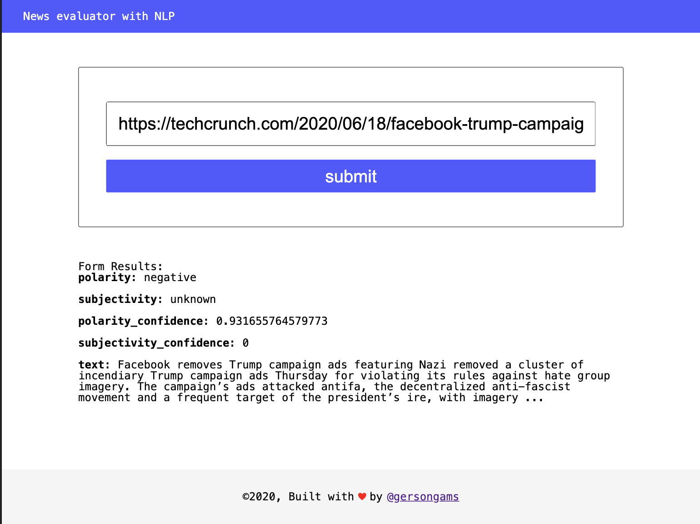

# News evaluator

Web application that use Natural Language Processing (NLP) on articles or blogs found on other websites
This project use the [Aylien](https://aylien.com/) API to process the webistes.



## Getting started

To run the project:

1. Clone the repo

```sh
git clone https://github.com/gersongams/news-evaluator-nlp
```

2. Install the dependecies

```sh
npm install # Or use yarn
```

3. Set up the enviroments variables, create a file `.env` and fill it

```.env
API_ID=YOUR_API_ID
API_KEY=YOUR_API_KEY
PORT=8080
HOST=localhost
```

4. To run the server (dev mode):

```sh
yarn dev
```

4. To run the frontend

```sh
yarn build-dev
```

Go to the http://localhost:8081 and test the app

## Production mode

To run the project in production mode run:

```sh
yarn start
```

## Tools used

- [Express](https://expressjs.com/) - For the backend
- [Webpack](https://webpack.js.org/) - Module bundler

## Demo

There is a demo for this application running in [https://news-evaluator-nlp.herokuapp.com/](https://news-evaluator-nlp.herokuapp.com/)

## Authors

Gerson garrido [@gersongams](https://github.com/gersongams/)
